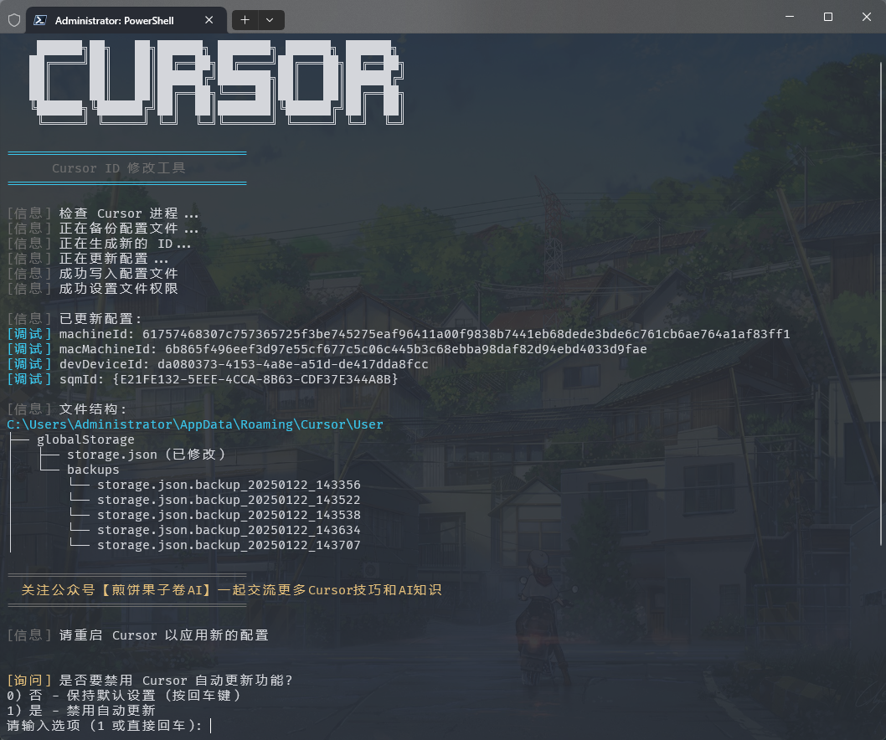
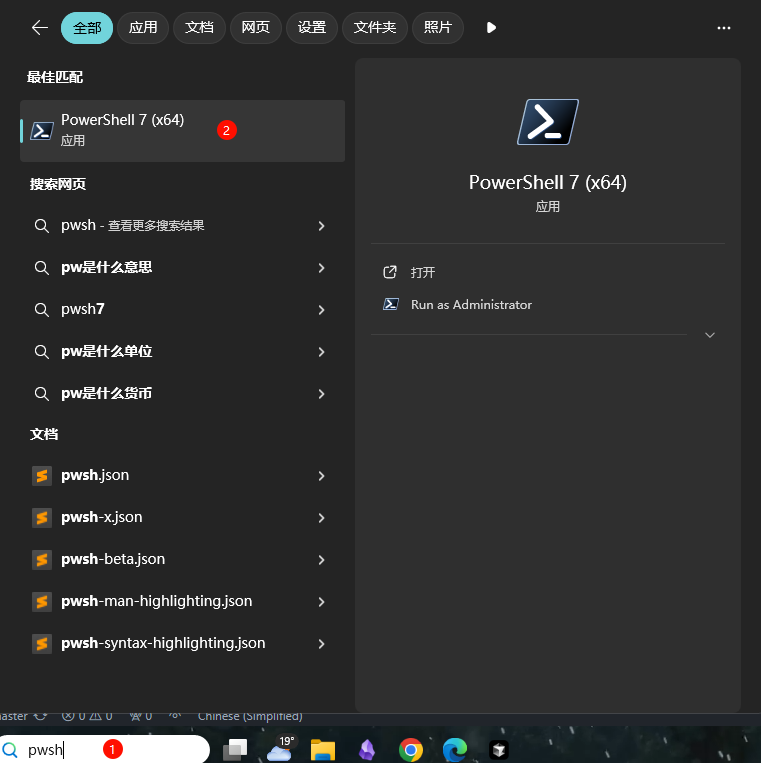
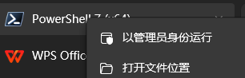

# 🚀 Cursor Free Trial Reset Tool

<div align="center">

[](https://github.com/yuaotian/go-cursor-help/releases/latest)
[](https://github.com/yuaotian/go-cursor-help/blob/master/LICENSE)
[](https://github.com/yuaotian/go-cursor-help/stargazers)

[🌟 English](README.md) | [🌏 中文](README_CN.md)


</div>

---

### 📝 Description

> When you encounter any of these messages:

#### Issue 1: Trial Account Limit <p align="right"><a href="#issue1"></a></p>

```text
Too many free trial accounts used on this machine.
Please upgrade to pro. We have this limit in place
to prevent abuse. Please let us know if you believe
this is a mistake.
```

#### Issue 2: API Key Limitation <p align="right"><a href="#issue2"></a></p>

```text
[New Issue]

Composer relies on custom models that cannot be billed to an API key.
Please disable API keys and use a Pro or Business subscription.
Request ID: xxxxxxxx-xxxx-xxxx-xxxx-xxxxxxxxxxxx
```

#### Issue 3: Trial Request Limit

> This indicates you've reached the usage limit during the VIP free trial period:

```text
You've reached your trial request limit.
```

<br>

<p id="issue2"></p>

#### Solution : Uninstall Cursor Completely And Reinstall (API key Issue)

1. Download [Geek.exe Uninstaller[Free]](https://geekuninstaller.com/download)
2. Uninstall Cursor app completely
3. Re-Install Cursor app
4. Continue to Solution 1

<br>

<p id="issue1"></p>

> Temporary Solution:

#### Solution 1: Quick Reset (Recommended)

1. Close Cursor application
2. Run the machine code reset script (see installation instructions below)
3. Reopen Cursor to continue using

#### Solution 2: Account Switch

1. File -> Cursor Settings -> Sign Out
2. Close Cursor
3. Run the machine code reset script
4. Login with a new account

#### Solution 3: Network Optimization

If the above solutions don't work, try:

- Switch to low-latency nodes (Recommended regions: Japan, Singapore, US, Hong Kong)
- Ensure network stability
- Clear browser cache and retry

### 💻 System Support

<table>
<tr>
<td>

**Windows** ✅

- x64 (64-bit)
- x86 (32-bit)

</td>
<td>

**macOS** ✅

- Intel (x64)
- Apple Silicon (M1/M2)

</td>
<td>

**Linux** ✅

- x64 (64-bit)
- x86 (32-bit)
- ARM64

</td>
</tr>
</table>

### 🚀 One-Click Solution

<details open>
<summary><b>Global Users</b></summary>

**macOS**

```bash
curl -fsSL https://raw.githubusercontent.com/yuaotian/go-cursor-help/refs/heads/master/scripts/run/cursor_mac_id_modifier.sh | sudo bash 
```

**Linux**

```bash
curl -fsSL https://raw.githubusercontent.com/yuaotian/go-cursor-help/refs/heads/master/scripts/run/cursor_linux_id_modifier.sh | sudo bash 
```

**Windows**

```powershell
irm https://raw.githubusercontent.com/yuaotian/go-cursor-help/refs/heads/master/scripts/run/cursor_win_id_modifier.ps1 | iex
```

<div align="center">

</div>

</details>

<details open>
<summary><b>China Users (Recommended)</b></summary>

**macOS**

```bash
curl -fsSL https://aizaozao.com/accelerate.php/c | sudo bash
```

**Linux**

```bash
curl -fsSL https://aizaozao.com/accelerate.php/https://raw.githubusercontent.com/yuaotian/go-cursor-help/refs/heads/master/scripts/run/cursor_linux_id_modifier.sh | sudo bash
```

**Windows**

```powershell
irm https://aizaozao.com/accelerate.php/https://raw.githubusercontent.com/yuaotian/go-cursor-help/refs/heads/master/scripts/run/cursor_win_id_modifier.ps1 | iex
```

</details>

<details open>
<summary><b>Windows Terminal Run and Configuration</b></summary>

#### How to Open Administrator Terminal in Windows:

##### Method 1: Using Win + X Shortcut
```md
1. Press Win + X key combination
2. Select one of these options from the menu:
   - "Windows PowerShell (Administrator)"
   - "Windows Terminal (Administrator)"
   - "Terminal (Administrator)"
   (Options may vary depending on Windows version)
```

##### Method 2: Using Win + R Run Command
```md
1. Press Win + R key combination
2. Type powershell or pwsh in the Run dialog
3. Press Ctrl + Shift + Enter to run as administrator
   or type in the opened window: Start-Process pwsh -Verb RunAs
4. Enter the reset script in the administrator terminal:

irm https://aizaozao.com/accelerate.php/https://raw.githubusercontent.com/yuaotian/go-cursor-help/refs/heads/master/scripts/run/cursor_win_id_modifier.ps1 | iex
```

##### Method 3: Using Search
>
>
>Type pwsh in the search box, right-click and select "Run as administrator"
>

Enter the reset script in the administrator terminal:
```powershell
irm https://aizaozao.com/accelerate.php/https://raw.githubusercontent.com/yuaotian/go-cursor-help/refs/heads/master/scripts/run/cursor_win_id_modifier.ps1 | iex
```

### 🔧 PowerShell Installation Guide 

If PowerShell is not installed on your system, you can install it using one of these methods:

#### Method 1: Install via Winget (Recommended)

1. Open Command Prompt or PowerShell
2. Run the following command:
```powershell
winget install --id Microsoft.PowerShell --source winget
```

#### Method 2: Manual Installation

1. Download the installer for your system:
   - [PowerShell-7.4.6-win-x64.msi](https://github.com/PowerShell/PowerShell/releases/download/v7.4.6/PowerShell-7.4.6-win-x64.msi) (64-bit systems)
   - [PowerShell-7.4.6-win-x86.msi](https://github.com/PowerShell/PowerShell/releases/download/v7.4.6/PowerShell-7.4.6-win-x86.msi) (32-bit systems)
   - [PowerShell-7.4.6-win-arm64.msi](https://github.com/PowerShell/PowerShell/releases/download/v7.4.6/PowerShell-7.4.6-win-arm64.msi) (ARM64 systems)

2. Double-click the downloaded installer and follow the installation prompts

> 💡 If you encounter any issues, please refer to the [Microsoft Official Installation Guide](https://learn.microsoft.com/en-us/powershell/scripting/install/installing-powershell-on-windows)

</details>

#### Windows 安装特性:

- 🔍 Automatically detects and uses PowerShell 7 if available
- 🛡️ Requests administrator privileges via UAC prompt
- 📝 Falls back to Windows PowerShell if PS7 isn't found
- 💡 Provides manual instructions if elevation fails

That's it! The script will:

1. ✨ Install the tool automatically
2. 🔄 Reset your Cursor trial immediately

### 📦 Manual Installation

> Download the appropriate file for your system from [releases](https://github.com/yuaotian/go-cursor-help/releases/latest)

<details>
<summary>Windows Packages</summary>

- 64-bit: `cursor-id-modifier_windows_x64.exe`
- 32-bit: `cursor-id-modifier_windows_x86.exe`
</details>

<details>
<summary>macOS Packages</summary>

- Intel: `cursor-id-modifier_darwin_x64_intel`
- M1/M2: `cursor-id-modifier_darwin_arm64_apple_silicon`
</details>

<details>
<summary>Linux Packages</summary>

- 64-bit: `cursor-id-modifier_linux_x64`
- 32-bit: `cursor-id-modifier_linux_x86`
- ARM64: `cursor-id-modifier_linux_arm64`
</details>

### 🔧 Technical Details

<details>
<summary><b>Configuration Files</b></summary>

The program modifies Cursor's `storage.json` config file located at:

- Windows: `%APPDATA%\Cursor\User\globalStorage\storage.json`
- macOS: `~/Library/Application Support/Cursor/User/globalStorage/storage.json`
- Linux: `~/.config/Cursor/User/globalStorage/storage.json`
</details>

<details>
<summary><b>Modified Fields</b></summary>

The tool generates new unique identifiers for:

- `telemetry.machineId`
- `telemetry.macMachineId`
- `telemetry.devDeviceId`
- `telemetry.sqmId`
</details>

<details>
<summary><b>Manual Auto-Update Disable</b></summary>

Windows users can manually disable the auto-update feature:

1. Close all Cursor processes
2. Delete directory: `C:\Users\username\AppData\Local\cursor-updater`
3. Create a file with the same name: `cursor-updater` (without extension)

macOS/Linux users can try to locate similar `cursor-updater` directory in their system and perform the same operation.

</details>

<details>
<summary><b>Safety Features</b></summary>

- ✅ Safe process termination
- ✅ Atomic file operations
- ✅ Error handling and recovery
</details>

---

### 📚 Recommended Reading

- [Cursor Issues Collection and Solutions](https://mp.weixin.qq.com/s/pnJrH7Ifx4WZvseeP1fcEA)
- [AI Universal Development Assistant Prompt Guide](https://mp.weixin.qq.com/s/PRPz-qVkFJSgkuEKkTdzwg)

---

## ⭐ Project Stats

<div align="center">

[](https://star-history.com/#yuaotian/go-cursor-help&Date)


</div>

## 📄 License

<details>
<summary><b>MIT License</b></summary>

Copyright (c) 2024

Permission is hereby granted, free of charge, to any person obtaining a copy
of this software and associated documentation files (the "Software"), to deal
in the Software without restriction, including without limitation the rights
to use, copy, modify, merge, publish, distribute, sublicense, and/or sell
copies of the Software, and to permit persons to whom the Software is
furnished to do so, subject to the following conditions:

The above copyright notice and this permission notice shall be included in all
copies or substantial portions of the Software.

</details>
